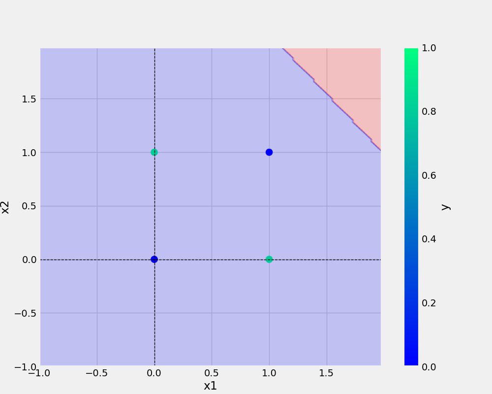

# One Neuron Perceptron

This project is to understand the one Neuron Perceptron

# How to use this project
1. The first step is to clone this project using command 
```
git clone https://github.com/mdnazmulislam0087/oneNeuron.git

```
2 .Create a new environment and use below code to install dependencies-
```
pip install -r requirement.txt

```
3. Run below codes one by one

    a. For and gate 
    ```
    python and.py

    ```
    b. For or gate 
    ```
    python or.py

    ```
    c. For nand gate 
    ```
    python nand.py

    ```
    d. For xor gate 
    ```
    python xor.py

    ```
4. Dataset Used
### AND
x1 | x2 | y
-|-|-
0|0|0
0|1|0
1|0|0
1|1|1

### OR
x1 | x2 | y
-|-|-
0|0|0
0|1|1
1|0|1
1|1|1


### NAND
x1 | x2 | y
-|-|-
0|0|1
0|1|1
1|0|1
1|1|0


### XOR
x1 | x2 | y
-|-|-
0|0|0
0|1|1
1|0|1
1|1|0

5. Result Analysis
## And Gate -


One neuron perceptron can classify AND gate perfectly as it is linear classification.

## OR Gate -


One neuron perceptron can classify OR gate perfectly as it is linear classification.


## Nand Gate -


One neuron perceptron can classify NAND gate perfectly as it is linear classification.

## XOR Gate -


One neuron perceptron can not classify XOR gate perfectly as it is not linear classification. This is the drawback of one Neuron Perceptron. Thats why we need more neuron. 


